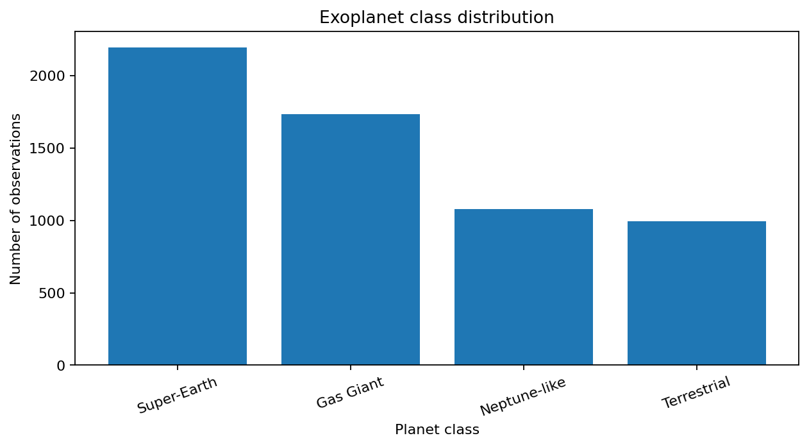
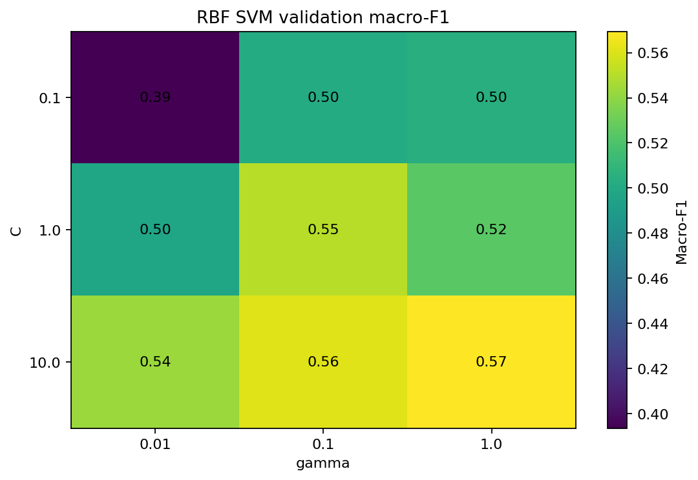
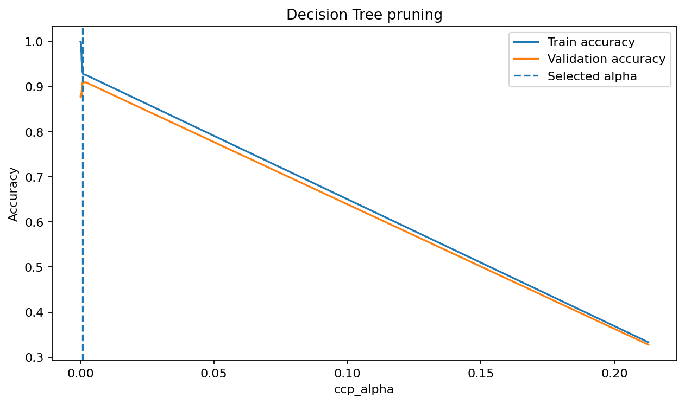
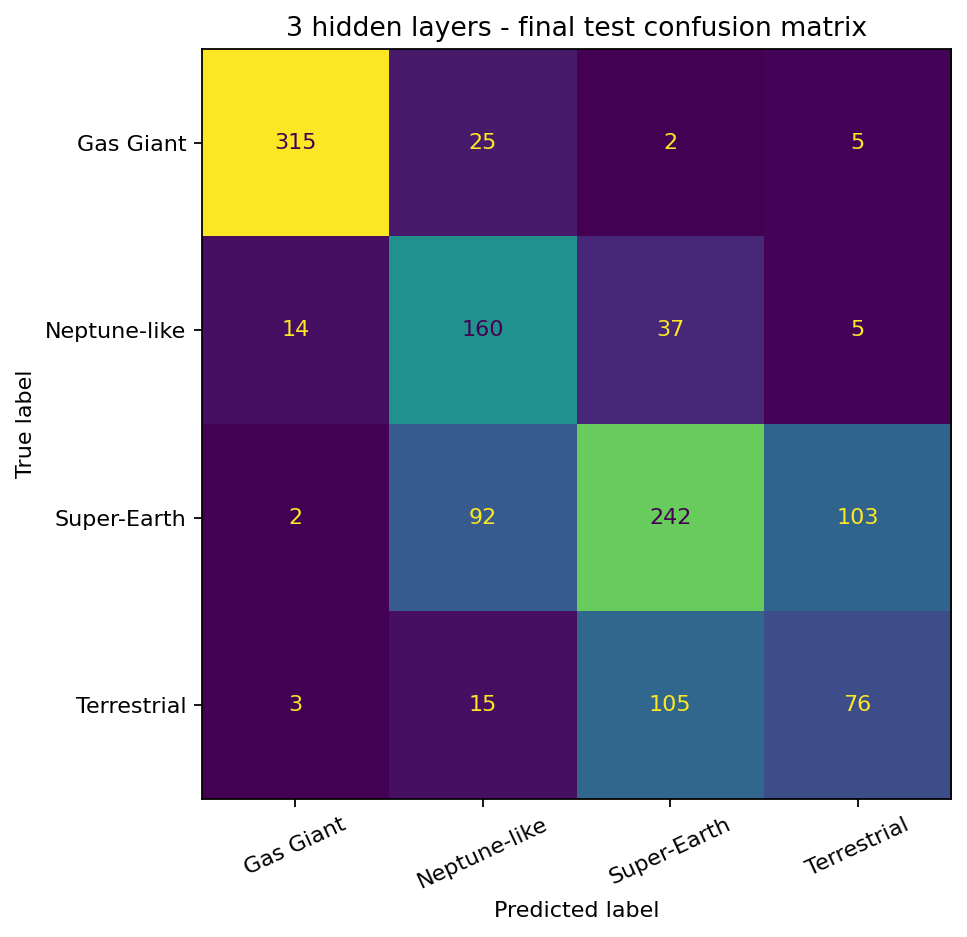

# Exoplanet Classification: SVM, Decision Trees & Neural Networks

A machine-learning portfolio project based on university coursework. The project explores exoplanet classification using classical models and PyTorch neural networks, with an emphasis on **clean evaluation methodology**, model interpretability, and class-confusion analysis.

## What this project demonstrates

- Exploratory data analysis of exoplanet classes and discovery trends
- Linear and RBF Support Vector Machines
- Feature scaling and SVM hyperparameter tuning
- Decision Tree pruning and feature importance
- Outlier analysis without changing the final test distribution
- PyTorch neural networks with class weighting, dropout, and early stopping
- Multiclass confusion analysis and focused binary classification
- Proper **train / validation / test separation** to reduce data leakage


## Key results

Using the cleaned evaluation setup:

- Standardizing the inputs improved the LinearSVC validation macro-F1 from **0.380** to **0.503**.
- The selected RBF SVM reached **0.584 test accuracy** and **0.564 macro-F1**.
- The pruned Decision Tree reached **0.923 test accuracy** and **0.916 macro-F1**.
- The selected 3-hidden-layer ANN reached **0.660 test accuracy** and **0.633 macro-F1**.
- The baseline ANN most often confused **Super-Earth** and **Terrestrial** planets on validation data. A focused binary ANN achieved **0.674 test ROC-AUC** for that pair.
- Removing IQR-flagged training outliers reduced performance for both the SVM and Decision Tree, supporting the decision to keep extreme but potentially valid observations.

These numbers are generated by the executed notebooks included in the repository.

## Project structure

```text
exoplanet-classification-ml/
├── README.md
├── requirements.txt
├── .gitignore
├── data/
│   └── README.md
├── figures/
│   ├── class_distribution.png
│   ├── discoveries_over_time.png
│   ├── svm_validation_grid.png
│   ├── decision_tree_pruning.png
│   ├── ann_final_confusion_matrix.png
│   └── binary_ann_roc.png
└── notebooks/
    ├── 01_svm_decision_trees.ipynb
    └── 02_neural_networks.ipynb
```

## Selected visuals

### Exoplanet class distribution


### RBF SVM validation grid


### Decision Tree pruning


### Neural-network confusion matrix


## Methodology improvements made for the portfolio version

The original laboratory notebooks were useful for exploration, but several evaluation steps were tightened before publishing:

1. **Hyperparameters are selected on validation data, not test data.**
2. **ANN early stopping monitors validation performance**, so the test set does not influence training.
3. **Decision Tree pruning (`ccp_alpha`) is chosen on validation data** and evaluated once on test data.
4. **Outlier SVM predictions use the same scaler fitted on the training data.**
5. **Outlier-removal experiments keep the test set unchanged**, making the comparison fairer.
6. The binary ANN task uses the **most-confused class pair detected from the validation confusion matrix**, preventing a mismatch between code comments and the actual labels.
7. Random seeds are fixed to make results easier to reproduce.

## Data

The coursework dataset contains NASA Exoplanet Archive-style planetary and stellar parameters plus a `planet_class` target used by the laboratory assignment.

The raw `exoplanet.csv` file is intentionally **not included in the public repository package by default**. See [`data/README.md`](data/README.md) for setup and attribution notes.

## Setup

```bash
python -m venv .venv
```

Activate the environment, then install dependencies:

```bash
pip install -r requirements.txt
```

Place `exoplanet.csv` in `data/`, then launch Jupyter:

```bash
jupyter lab
```

Open the notebooks in numerical order.

## Technologies

Python · pandas · NumPy · scikit-learn · PyTorch · Matplotlib · Jupyter

## Notes

This repository is a cleaned portfolio version of university laboratory work. The emphasis is on demonstrating the reasoning behind model selection and evaluation rather than maximizing a single accuracy score.
